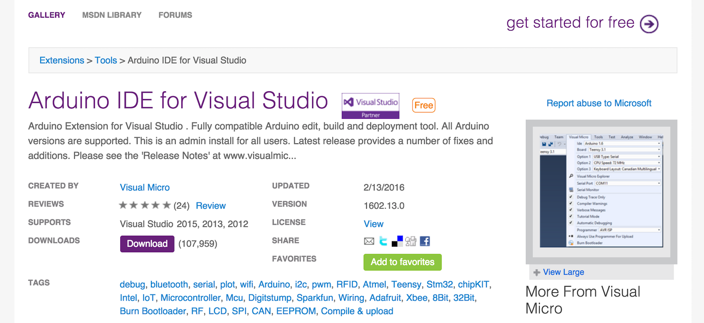
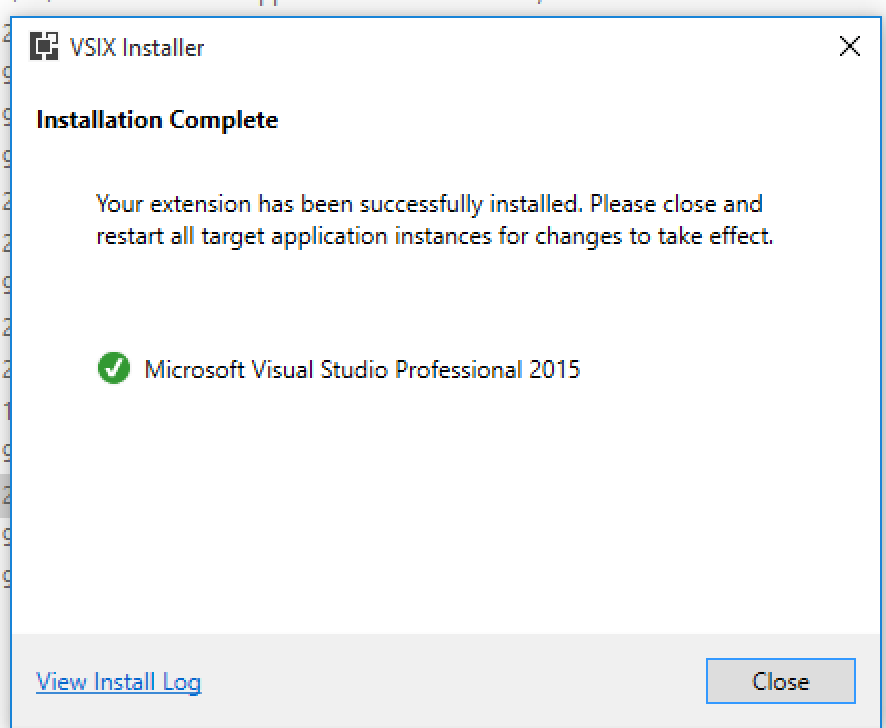
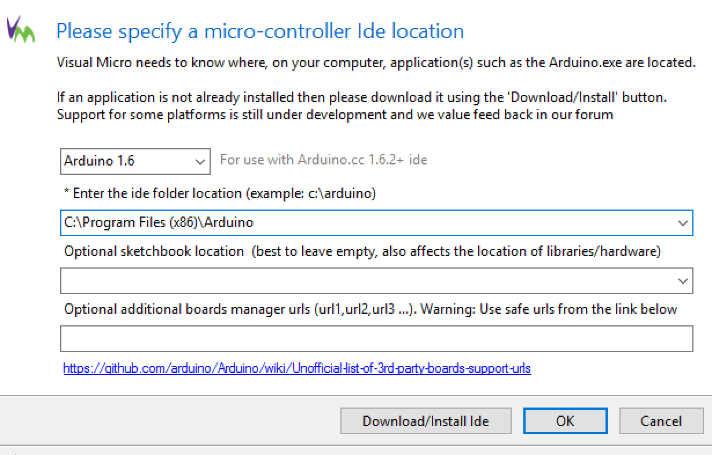

##How to install visual micro for Visual Studio 2015
Before you install visual micro make sure you have the [Arduino IDE](https://www.arduino.cc/en/Main/Software) installed.  Visual Mico is an plugin for Visual Studio that allow you to visual studio as your IDE for the arduino microcontroller.  In this tutorial I will be installing for [Visual Studio Community 2015](https://www.visualstudio.com/products/visual-studio-community-vs).

###1. Download visual micro's Arduino IDE for Visual Studio

###2.  Install the plugin.  Once it's complete you will see the following screen.

###3. Once the installation is complete you have to tell visual micro where the Arduino.exe is installed  
###4.  That's it, installation complete; you should now see an Arduino tool bar in Visual Studio.
