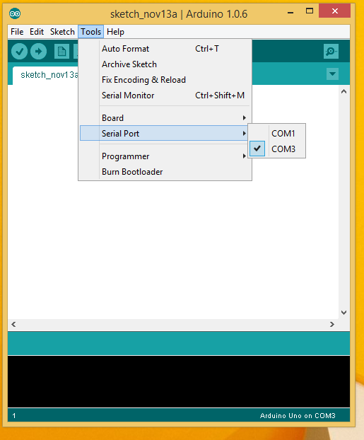

Today I will show you how to install the Arduino IDE for Windows 8.1.

Download the Arduino IDE from [arduino.cc](http://arduino.cc/en/Main/Software) click on the download tab.  We will be using the lastest version available, which is 1.0.6 at the time of this tutorial.  

### Install the Arduino IDE

1. You will see the license agreement screen click **I agree**  

2. On the Install options leave the default options selected and click **Next**   
3. Select your destination folder and click **Install**  
4. Arduino setup will not install the necessary files  
5. Click **Close** once the install is complete  

### Verify that the  Arduino works

1. Plug in the Arduino microcontroller into your PC
2. Goto Device Manager and under ports you should see the Arduino uno  and the “com” name and number next to it.  In my case it was “com3”  
 
3. Goto **Tools** – **Serial Port** – **com#** then select the port your Arduino is on,  from the what you discovered in device manager(step 2)  
4. Goto **File** - **Examples** – **01.Basic** – **Blink** and select **Blink**  
5. Once you have selected the blink program it will open  
6. Click the upload to programmer button to upload to the program to the Arduino  
7. You should now have a flashing light on your Arduino 

